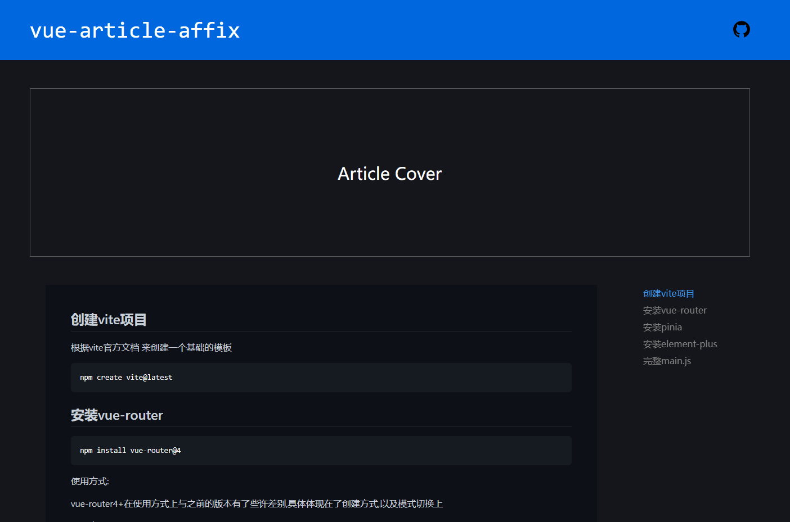

# vue-article-affix

Vue.js的模板插件，基于文章内容生成右侧文章目录。点击[demo](https://11003.github.io/vue-article-affix/)查看效果，也可以看我的[博客文章](https://liuhai.work/post/425?cid=51&index=true)




## 安装

```sh
npm install
```

### Compile and Hot-Reload for Development

```sh
npm run dev
```

### Compile and Minify for Production

```sh
npm run build
```

## 其他

node版本: v16.13.0

我的博客：[Sonder](https://liuhai.work)
